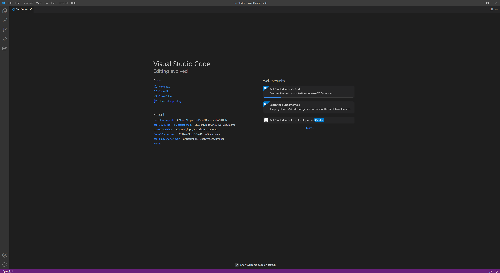

# Working remotely!
This guide demonstrates the various steps required to log into a course specific account associated with *ieng6*, run commands remotely, copy files over, generate an ssh key, and more.

***Step 1***

&emsp; **Download and install [Visual Studio Code](https://code.visualstudio.com/).**

This is a great editor for working with code and using a terminal, which will make what we're about to do a breeze.
     
***Step 2***
 
&emsp; **Setup and install [OpenSSH](https://docs.microsoft.com/en-us/windows-server/administration/openssh/openssh_install_firstuse).**
 
You may or may not already have this installed; I personally already had the client but I had to install the server.
     
***Step 3***
 
&emsp; **Connect remotely.**
 
Here we're going to actually connect to the ieng6 server with our course account, which can be found [here](https://sdacs.ucsd.edu/~icc/index.php). After you've found your account, in order to actually connect to the server, you'll have to open a new terminal as such.

From here we're able to start typing in the necessary commands.
 
Next, we're going to connect by typing in the command `ssh cs15lwi22zz@ieng6.ucsd.edu`, but with your unique account letters in place of the `zz` placeholders.
 
From there you'll be prompted for your password. Note that typing in the password won't show anything as you're typing, so just type it and press enter. After successfully logging in you should see something like this.

Now you're connected!
 
Prior to performing this command, you were inside of your own directory, something like `PS C:\Users\username`, but now you're inside of the directory associated with your *ieng6* account located on its server! Note that you can type `exit` or `CTRL + D` to exit to close the connection and return to your own directory.
     
***Step 4***
 
&emsp; **Testing out some commands.**
 
Now we want to use some common commands to understand what's in this account's directory. Go ahead and try:
* `pwd` - to print the working directory
* `ls` - to print the directories' contents
* `cd` - to change the directory
* `mkdir` - to make a new directory
 

     
***Step 5***
 
&emsp; **Moving files.**
 
Now we're going to `exit` out of our *ieng6* and copy a file over. To do so, when you're back in your own directory, we're going to use the `scp` command. Let's say we have a basic java file containing `Hello World`:

As of right now this file only exists in our own local directory, but we're going to upload it to our *ieng6* account using
`scp HelloWorld.java cs15lwi22zz@ieng6.ucsd.edu:~/`, again replacing the `zz` letters with your account specific ones. Again, you'll be prompted for your password, just enter it, and then it's copied over!
 
`ssh` back over and see the file by using `ls`, `javac HelloWorld.java`, and `java HelloWorld` just like you would from your own directory to run it over there! Note that running files remotely works exactly the same as locally! Talk about convenience!

     
***Step 6***
 
&emsp; **Setting up an SSH key.**
 
Notice that we have to enter our password every time we log into the server or copy something over? Well, the good news is that there's a workaround in the form of `ssh` keys. 
 

First thing, make sure you're back on your local directory and then type `ssh-keygen`. Go ahead and press enter through the steps and it'll end up generating a random art image. This created two files, a private `id_rsa` and a public `id_rsa.pub` one stored inside of our `.ssh` directory.
 

Now we need to log in *ieng6* and `mkdir .ssh` in order to create a remote directory that matches our own.
 

Next, `exit` back out and copy the public `id_rsa.pub` over from our own directory by something like `scp /Users/joe/.ssh/id_rsa.pub cs15lwi22zz@ieng6.ucsd.edu:~/.ssh/authorized_keys` where you replace /Users/joe/ with your own directory containing the file and again, replace the `zz` with your own letters.

Now you should be able to login without providing a password! Yay!
     
***Step 7***
 
&emsp; **Remote running convenience.**
 
Alright, now we're going to try out something pretty neat. Imagine we're updating a file, but we want to run it on the remote server. From what we know how to do, we would update the file on our own machine, copy it over to the server, log in to the server, run it, and then log back out.
 
However, there's a convenient way to do this by chaining together commands.
 
In example, imagine we updated our HelloWorld.java as such:

Now we can run:

 `scp HelloWorld.java cs15lwi22ate@ieng6.ucsd.edu:~/; ssh cs15lwi22ate@ieng6.ucsd.edu "javac HelloWorld.java; java HelloWorld"`

As such:

