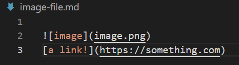
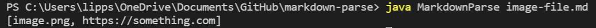
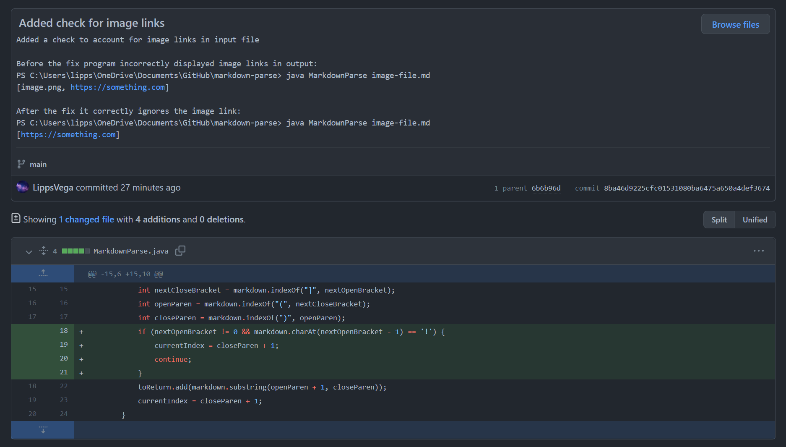
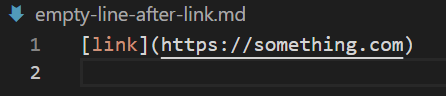
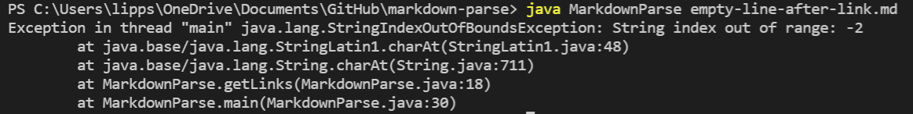
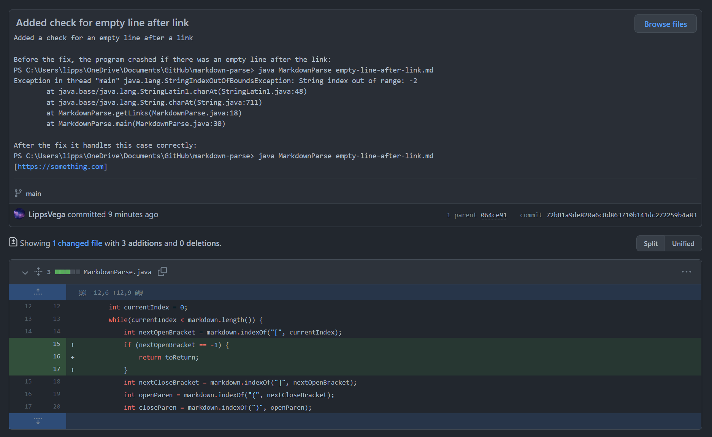
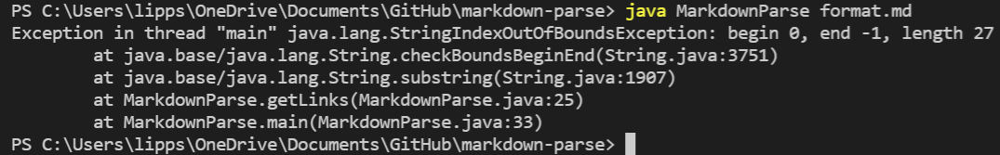
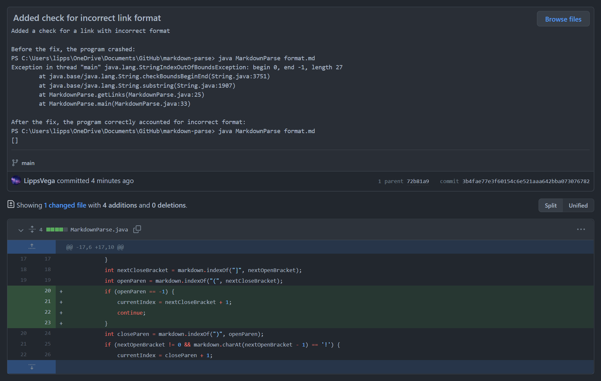

# Debugging with GitHub!
This lab report showcases three different failure-inducing inputs that our group found and fixed, using GitHub to keep track of the changes, while working with [MarkdownParse.java](https://github.com/LippsVega/markdown-parse/blob/main/MarkdownParse.java).
  

***Failure-Inducing Input 1***

The first problem our group addressed was that of the case where an image link was provided in the input file, which looks like this:

**[Here's the image-file link.](https://github.com/LippsVega/markdown-parse/blob/main/image-file.md)**

Here's the output from this file:

The problem with this output is that it's not only displaying the hyperlinks, but also the image links.

To fix this, we added a check in the code of which is shown here:

**[Here's the change history link.](https://github.com/LippsVega/markdown-parse/commit/8ba46d9225cfc01531080ba6475a650a4def3674#diff-c703a0ec03474d601c6bf846740b293e0538bccf38d5f677a302457479e9c652)**

In summary, we noticed the symptom of the program printing out all links, including image links, which went against its intended behavior of printing only hyperlinks. We went on to discover that the bug that caused this was due to not accounting for cases where the `!` comes before the first bracket, as is the case with image links. So to account for this specific case, we put in a check to see if the character before the next open bracket is is actually `!` and adjusted the index used for traversal accordingly.
  

***Failure-Inducing Input 2***

The second problem that our group addressed was that of the case where there was an empty line after the link, which looks like this:

**[Here's the empty-line-after-link file link.](https://github.com/LippsVega/markdown-parse/blob/main/empty-line-after-link.md)**

Here's the output from this file:

Here the program crashed, throwing an index out of bounds exception.

To fix this, we added a check to make sure that the next open bracket was actually found.

**[Here's the change history link.](https://github.com/LippsVega/markdown-parse/commit/72b81a9de820a6c8d863710b141dc272259b4a83#diff-c703a0ec03474d601c6bf846740b293e0538bccf38d5f677a302457479e9c652)**

In summary, we experienced the symptom of the program crashing by throwing an exception when an input file was read with an empty line after a link. By examining the error message, we were able see that the index out of bounds exception was being thrown due to `charAt` accessing an invalid index, because of the bug of not accounting for the case where a next open bracket wasn't found. To fix this, we added the necessary check for when the next open bracket isn't found and returned accordingly.
  

***Failure-Inducing Input 3***

The third problem we addressed was the case where the link isn't formatted correctly, like this:

**[Here's the format file link.](https://github.com/LippsVega/markdown-parse/blob/main/format.md)**

Here's the output from this file:

Again, the program crashed, throwing an index out of bounds exception.

To fix this, we accounted for the case where an open parenthesis isn't found.

**[Here's the change history link.](https://github.com/LippsVega/markdown-parse/commit/3b4fae77e3f60154c6e521aaa642bba073076782#diff-c703a0ec03474d601c6bf846740b293e0538bccf38d5f677a302457479e9c652)**

In summary, we experienced the symptom of the program crashing by throwing an exception when the an input file was read with an incorrect format, particularly when it was missing the parenthesis. From the error message, we could see that `substring` was being called with a starting index 0 and ending index of 1, which was due to the bug of not accounting for the case when the next open parenthesis is not found. To fix this, we added the necessary check and adjusted the index used by `substring` accordingly.