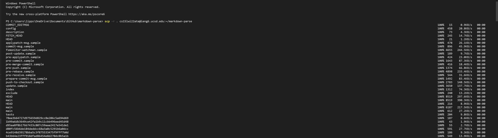
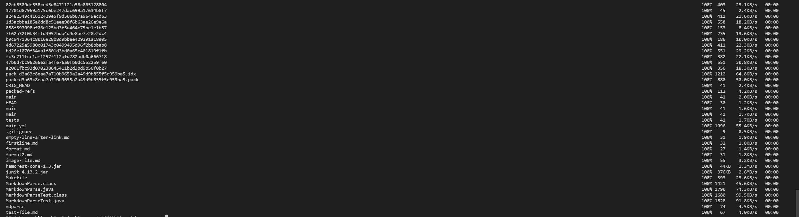
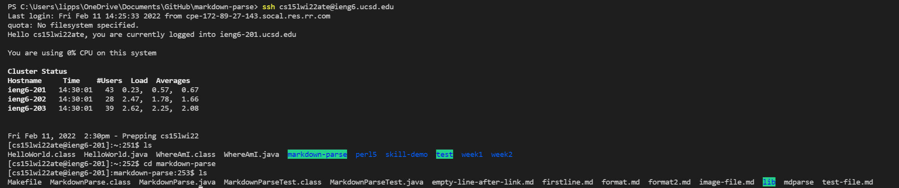
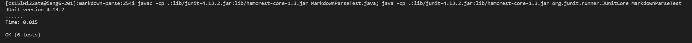
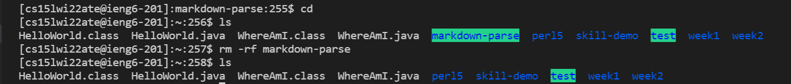
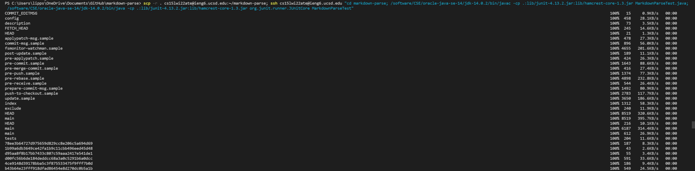
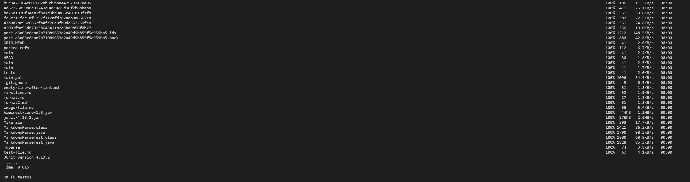

# Copying whole directories and running tests remotely!
This lab report shows how we can copy whole directories to a remote account using `scp -r` and then run files contained within on that account. To illustrate the process, we will be copying our `markdown-parse` directory from our own local directory to the `ieng6` server and running the tests contained in `MarkdownParseTest.java`.
   

***Copying the directory***

To begin, let's copy our whole directory of `markdown-parse` over to `ieng6`. Assuming we're already in the `markdown-parse` directory, we can use the command:

`scp -r . cs15lwi22zz@ieng6.ucsd.edu:~/markdown-parse`
 

Here `scp` is the server copy command and the `-r` means to do so recusrively. You have to specify the `-r` flag because it has to copy each file inside of the directory over. The `.` source is our current directory, and the rest of the command specifies the destination.
 

You'll notice that a lot of things get copied over.
   

***Running the tests***

First let's log into our `ieng6` account and verify `markdown-parse` exists there:

Now let's run the `JUnit` tests using:

`javac -cp .:lib/junit-4.13.2.jar:lib/hamcrest-core-1.3.jar MarkdownParseTest.java`

`java -cp .:lib/junit-4.13.2.jar:lib/hamcrest-core-1.3.jar org.junit.runner.JUnitCore MarkdownParseTest`

Notice that you can connect the commands in one line by separating them with `;`.
   

***Cleaning up***

For the next part, we're going to remove the directory from our `ieng6` account in order to demonstrate the next step. We can do so using:

`rm -rf markdown-parse`

Here `rm` means to remove, and the flags `-rf` to force it recursively. Again you have to specify `-r` to remove each file, and the `-f` saves you from having to type `yes` to each removal.

Notice that `markdown-parse` is now gone.
   

***Copying and running in one line***

Now for the reason why we wanted to remove the directory in the first place. We're going to copy and run the tests all in one line, rather than simply copying over, logging in remotely, and then running the tests. This can be useful if all we want to do is copy the directory over and then run the tests. We can do this using:

`scp -r . cs15lwi22zz@ieng6.ucsd.edu:~/markdown-parse; ssh cs15lwi22zz@ieng6.ucsd.edu "cd markdown-parse; /software/CSE/oracle-java-se-14/jdk-14.0.2/bin/javac -cp .:lib/junit-4.13.2.jar:lib/hamcrest-core-1.3.jar MarkdownParseTest.java; /software/CSE/oracle-java-se-14/jdk-14.0.2/bin/java -cp .:lib/junit-4.13.2.jar:lib/hamcrest-core-1.3.jar org.junit.runner.JUnitCore MarkdownParseTest"`

Here we chain the commands using `;` as pointed out earlier, and the `""` around the commands we want to run remotely. Note that we had to specify `/software/CSE/oracle-java-se-14/jdk-14.0.2/bin/` before `javac` and `java` because of version compilation differences; this forces the remote account to use the specific version it needs to in order to compile and run.

   
And that concludes this guide!