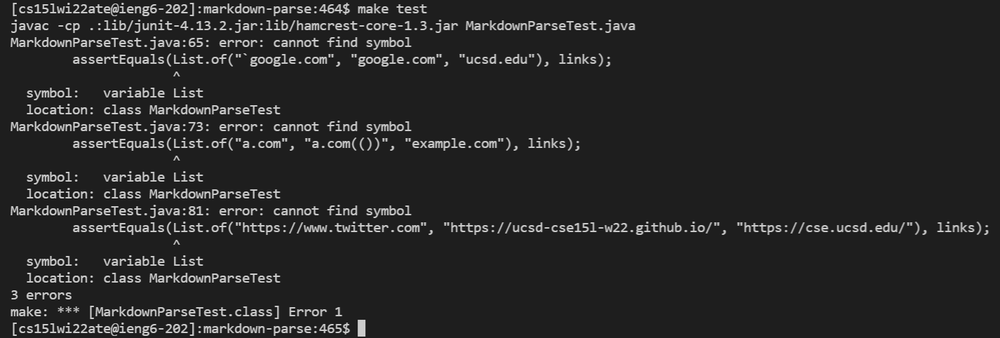
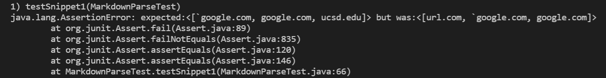
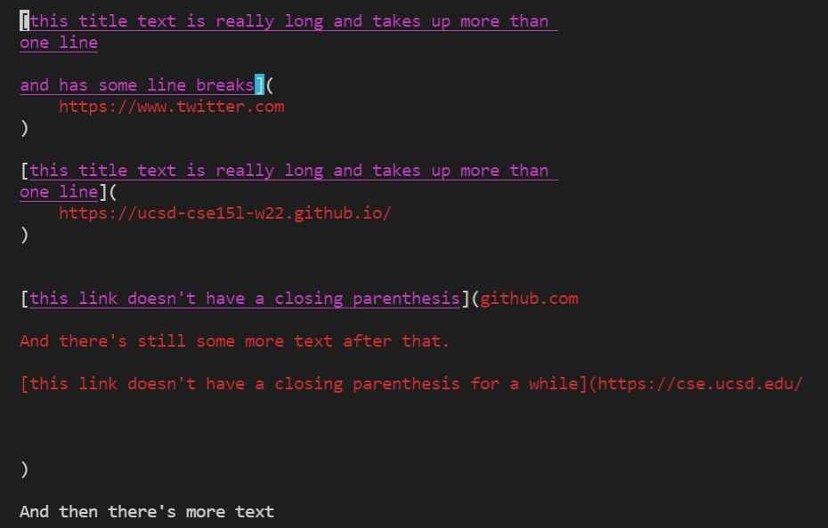
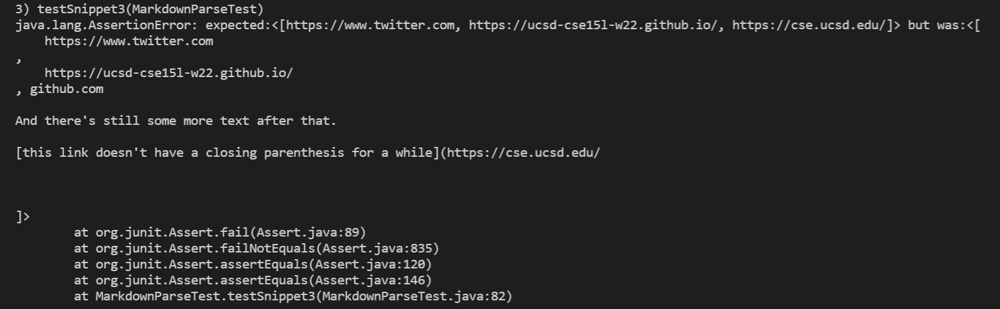

# Testing code snippets on 2 separate implementations!
This lab report tests 3 different snippets of code on 2 separate implementations of `MarkdownParse.java`. The first implementation to be tested on is [mine](https://github.com/LippsVega/markdown-parse/blob/main/MarkdownParseTest.java), and the second is [this one](https://github.com/johnsonli010801/markdown-parse/blob/main/MarkdownParse.java).

***Getting started***

The tests I created can be found [here](https://github.com/LippsVega/markdown-parse/blob/main/MarkdownParseTest.java).

Here they are for reference:

To run these tests, I placed them all in `MarkdownParseTest.java` on both [my implementation](https://github.com/LippsVega/markdown-parse/blob/main/MarkdownParseTest.java) and the [other's implementation](https://github.com/johnsonli010801/markdown-parse/blob/main/MarkdownParseTest.java). Then I proceeded to run the tests using `make test` to run each repository's Makefile which ran the JUnit tests contained in `MarkdownParsetTest.java`. Here's [my Makefile](https://github.com/LippsVega/markdown-parse/blob/main/Makefile), and here's [the other](https://github.com/johnsonli010801/markdown-parse/blob/main/makefile).

Here's the complete output of running `make test` on my implementation:

Now, running `make test` on the other implementation didn't work at first:

It turned out, that it was missing an import:

After fixing that, it ran:

As you can see, all 3 tests failed on both implementations! Next we'll examine each code snippet more closely, and theorize as to whether a small or large code change can fix the issue.
   

***Code snippet 1***

So let's start with the first code snippet test contained in [snippet1](https://github.com/LippsVega/markdown-parse/blob/main/snippet1.md).

For reference, here's the output of my `JUnit` test:

And on the other implementation:

As you can see, the test didn't pass on either!
   

***Code snippet2***

Now let's move on to the code snippet contained in [snippet2](https://github.com/LippsVega/markdown-parse/blob/main/snippet2.md).

Here's my JUnit output:

And the other:

Again, the test didn't pass on either!
   

***Code snippet3***

And lastly, the code found in [snippet3](https://github.com/LippsVega/markdown-parse/blob/main/snippet3.md).

My output:

Other output:

Again, the test failed on both implementations.