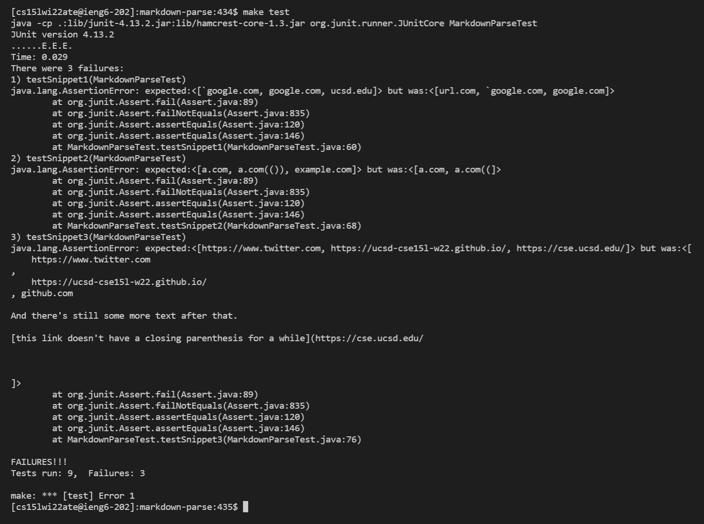
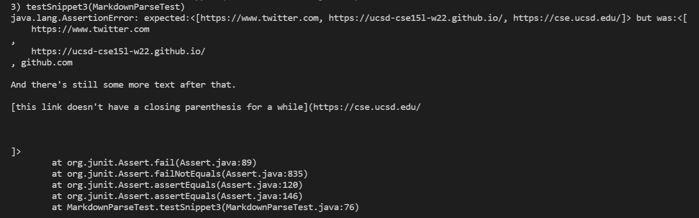

# Testing code snippets on 2 separate implementations!
This lab report tests 3 different snippets of code on 2 separate implementations of `MarkdownParse.java`. The first implementation to be tested on is [mine](https://github.com/LippsVega/markdown-parse/blob/main/MarkdownParseTest.java), and the second is [this one](https://github.com/johnsonli010801/markdown-parse/blob/main/MarkdownParse.java).

Here are the repositories for reference:

[My repository](https://github.com/LippsVega/markdown-parse)

[Other repository by johnsonli010801](https://github.com/johnsonli010801/markdown-parse)
   

***Getting started***

The tests I created can be found [here](https://github.com/LippsVega/markdown-parse/blob/main/MarkdownParseTest.java).

Here they are for reference:

To run these tests, I placed them all in `MarkdownParseTest.java` on both [my implementation](https://github.com/LippsVega/markdown-parse/blob/main/MarkdownParseTest.java) and the [other's implementation](https://github.com/johnsonli010801/markdown-parse/blob/main/MarkdownParseTest.java). Then I proceeded to run the tests using `make test` to run each repository's Makefile which ran the JUnit tests contained in `MarkdownParsetTest.java`. Here's [my Makefile](https://github.com/LippsVega/markdown-parse/blob/main/Makefile), and here's [the other](https://github.com/johnsonli010801/markdown-parse/blob/main/makefile).

Here's the complete output of running `make test` on my implementation:

Now, running `make test` on the other implementation didn't work at first:

It turned out, that it was missing an import:

After fixing that, it ran:

As you can see, all 3 tests failed on both implementations! Next we'll examine each code snippet more closely, and theorize as to whether a small or large code change can fix the issue.
   

***Code snippet 1***

So let's start with the first code snippet test contained in [snippet1](https://github.com/LippsVega/markdown-parse/blob/main/snippet1.md).

For reference, here's the output of my `JUnit` test:

And on the other implementation:

Here we expected links to contain \``google.com`, `google.com`, and `ucsd.edu` as those are considered valid links according to `VSCode preview`, but we got `url.com`, \``google.com`, and `google.com`. We weren't supposed to have `url.com` because of the first backtick preceding the first open bracket having been completed with the backtick within the brackets, and we were supposed to have `ucsd.edu`, but we didn't because the backticks surrounding the nested closing bracket weren't accounted for.

Therefore, to fix this issue we would need to account for whether or not backticks are present and complete, and treat everything between them as separate from the way we handle links. This could take a lot of changes to implement because you would need to account for backticks both before and in the link and whether or not they are actually complete. For example, if you encounter a backtick you would need to handle the input differently until the next backtick, but then essentially revert back to handling the input as if the backtick doesn't matter if there isn't a second backtick.
   

***Code snippet2***

Now let's move on to the code snippet contained in [snippet2](https://github.com/LippsVega/markdown-parse/blob/main/snippet2.md).

Here's my JUnit output:

And the other:

Here we expected `.com`, `a.com(())`, and `example.com`, but we got `a.com`, and `a.com((`. The reason for these differences is because we didn't account for nested brackets and parenthesis.

To fix this we would need to implement a way to keep track of the number of opening and closing brackets and parenthesis, allowing for them to be nested if complete. This shouldn't take that many changes as you would simply implement counts that would be updated to keep track of whether or not they are matching and handle the input accordingly. 
   

***Code snippet3***

And lastly, the code found in [snippet3](https://github.com/LippsVega/markdown-parse/blob/main/snippet3.md).

My output:

Other output:

Here we expected `https://www.twitter.com`, `https://ucsd-cse15l-w22.github.io/`, and `https://cse.ucsd.edu/`, but received received some of the links with a bunch of space and extra stuff.

To fix this we need to account for the case where there's space and line breaks in between the brackets and parenthesis, as well as whether or not there are closing brackets and parenthesis. To do this, it shouldn't take that many changes to fix as we would just need to account for spaces and lines in between the brackets and parenthesis, while not allowing for them in between the a closing bracket and an opening parenthesis.
   
And that concludes this lab report!