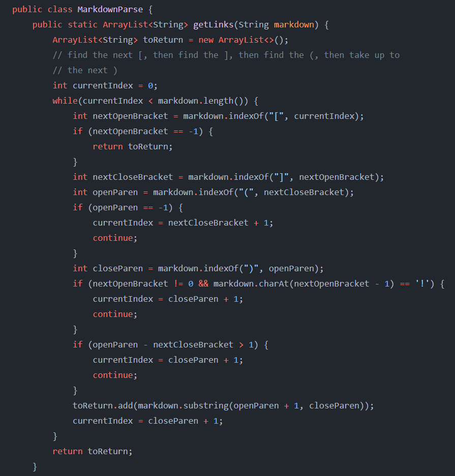

# Comparing results from 2 different implementations!
This lab report compares the `getLinks` output from 2 different implementations of `MarkdownParse.java`, [mine](https://github.com/LippsVega/markdown-parse), and [the professor's (jpolitz)](https://github.com/ucsd-cse15l-w22/markdown-parse).
<br /><br /><br />

***Getting the test results***

To actually run the tests, I put the following bash script, named `script.sh`, into both `markdown-parse` directories:


Here, for each file in the test-files directory, it will `echo` each filename along with the result of `getLinks`.
Additionally, I output the results of running this into a results file, in this case `results.txt`, by running the bash script with output redirection as in:
```
bash script.sh > results.txt
```
I did this in both `markdown-parse` repositories, which gave me 2 different `results.txt` files, one with the tests for my implementation, and one for the professor's.

Since this created files with 2 different sets of output, I then proceeded to compare the output using `diff`:
```
diff markdown-parse/results.txt md-p/markdown-parse/results.txt
```
Where my results were in the first `markdown-parse` repository and the professor's in `md-p`.

This conveniently displays all of the differences between the files. So now let's move on and compare 2 different test outputs.
<br /><br /><br />

***Test 1***


Here, on line 106 of `results.txt`, from the test `194.md`, my link was empty as shown by `[]`, while the professor's was actually interpreted as a link as in `[url]`. So now let's figure out if either of our implementations are actually correct. To begin, let's view the contents of that specific file inside of `test-files`. Inside of `test-files`:
```
cat 194.md
```
We get:


Now at a glance, I honestly have no idea what the actual correct output of this should be, so I'll check the expected output on `Visual Studio Code Preview`:


So, it turns out that neither of us have a correct implementation for this!

It's hard to pinpoint exactly how this link is supposed to work, and after experimenting I've found that it has something to do with the way the colon is interpreted. For some reason, because of the colon, the text that comes after it (until the next space) is treated as a link, but only if text inside both sets of brackets match (both sets of brackets are required). Further, the double closing brackets at the end of each set of brackets is required, and the second set of brackets has to come on the next line. Reading up on this, it seems that it has something to do with the way definitions are rendered.

As for a fix for this, I honestly can't give a real one; however, I can hypothesize that it would require keeping track of the number of closing brackets, a check for double closing brackets, checking for a colon, evaluating the following text, and have a check for matching close bracket text on a following line.

Examining my own implementation:



It's quite clear that there's a *lot* that needs to be done as we haven't even remotely started to account for this case!

Also, note the professor's implementation:


The professor's implementation happened to get the `url` part of the link, but not the whole `my_url` because it happened to count what was inside of the parenthesis as a link, yet it didn't actually consider or handle this specific case at all either!
<br /><br /><br />

***Test 2***


Here, the line 470 of `results.txt`, from the test `519.md`, again my link was empty as shown by `[]`, while again the professor's intrepreted it as a link as in `[uri1]`. Let's examine the test file itself to see if either of our implementations handle this case correctly. Inside of `test-files`:
```
cat 519.md
```
We get:


Fortunately, the correct output for this test is much more clear. It's clear that this shouldn't be a link, as it's an image as represented by the `!` prior to the brackets. Of course, just to be safe, examining in it in `Visual Studio Code Preview` we get: 


This shows that it indeed should be handled as an image.

So, in this case my implementation handles the case correctly, and it's because of this code:


For the professor's implementation, we would only have to add an equivalent check after:


And it would work correctly.
<br /><br /><br />

And that concludes this lab report!